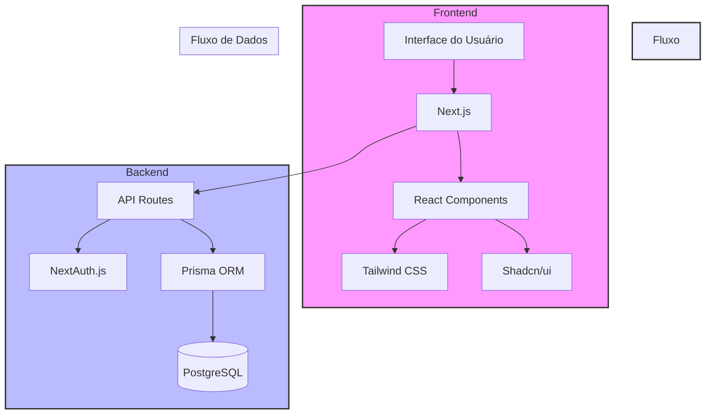

```mermaid
graph TB
    subgraph Frontend
        UI[Interface do Usuário]
        Next[Next.js]
        React[React Components]
        Tailwind[Tailwind CSS]
        Shadcn[Shadcn/ui]
    end

    subgraph Backend
        API[API Routes]
        Auth[NextAuth.js]
        Prisma[Prisma ORM]
        DB[(PostgreSQL)]
    end

    subgraph Fluxo de Dados
        UI --> Next
        Next --> React
        React --> Tailwind
        React --> Shadcn
        Next --> API
        API --> Auth
        API --> Prisma
        Prisma --> DB
    end

    style Frontend fill:#f9f,stroke:#333,stroke-width:2px
    style Backend fill:#bbf,stroke:#333,stroke-width:2px
    style Fluxo de Dados fill:#bfb,stroke:#333,stroke-width:2px
``` 