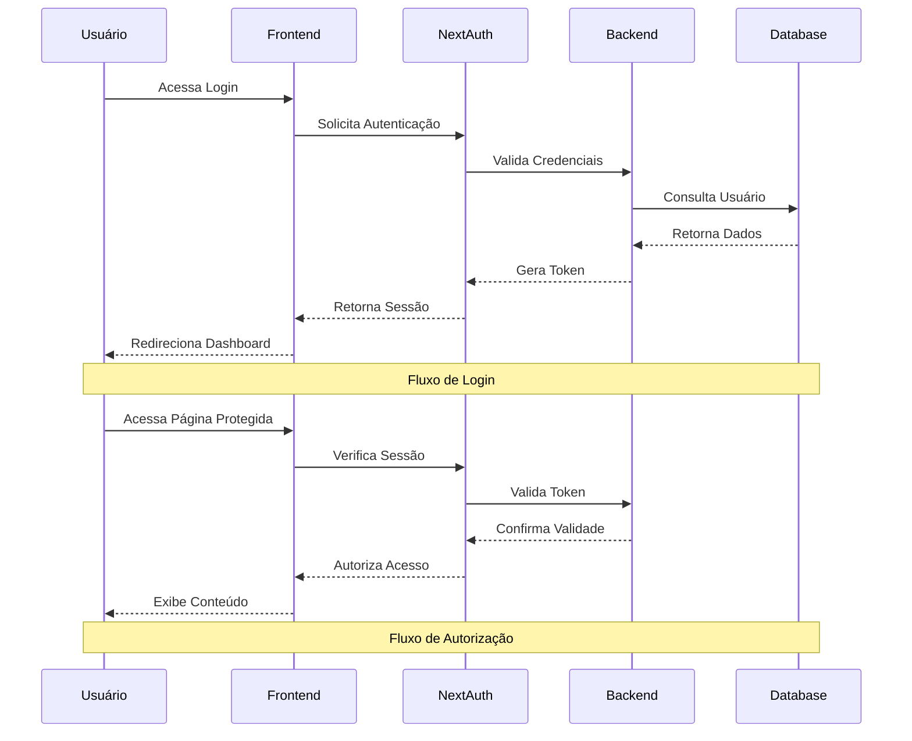

```mermaid
sequenceDiagram
    participant U as Usuário
    participant F as Frontend
    participant A as NextAuth
    participant B as Backend
    participant D as Database

    U->>F: Acessa Login
    F->>A: Solicita Autenticação
    A->>B: Valida Credenciais
    B->>D: Consulta Usuário
    D-->>B: Retorna Dados
    B-->>A: Gera Token
    A-->>F: Retorna Sessão
    F-->>U: Redireciona Dashboard

    Note over U,D: Fluxo de Login

    U->>F: Acessa Página Protegida
    F->>A: Verifica Sessão
    A->>B: Valida Token
    B-->>A: Confirma Validade
    A-->>F: Autoriza Acesso
    F-->>U: Exibe Conteúdo

    Note over U,D: Fluxo de Autorização
``` 