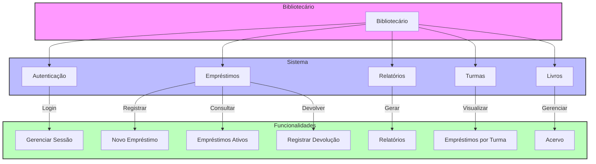

```mermaid
graph TB
    subgraph Bibliotecário
        B[Bibliotecário]
    end

    subgraph Sistema
        A[Autenticação]
        E[Empréstimos]
        R[Relatórios]
        T[Turmas]
        L[Livros]
    end

    B --> A
    B --> E
    B --> R
    B --> T
    B --> L

    subgraph Funcionalidades
        A --> |Login| A1[Gerenciar Sessão]
        E --> |Registrar| E1[Novo Empréstimo]
        E --> |Consultar| E2[Empréstimos Ativos]
        E --> |Devolver| E3[Registrar Devolução]
        R --> |Gerar| R1[Relatórios]
        T --> |Visualizar| T1[Empréstimos por Turma]
        L --> |Gerenciar| L1[Acervo]
    end

    style Bibliotecário fill:#f9f,stroke:#333,stroke-width:2px
    style Sistema fill:#bbf,stroke:#333,stroke-width:2px
    style Funcionalidades fill:#bfb,stroke:#333,stroke-width:2px
``` 