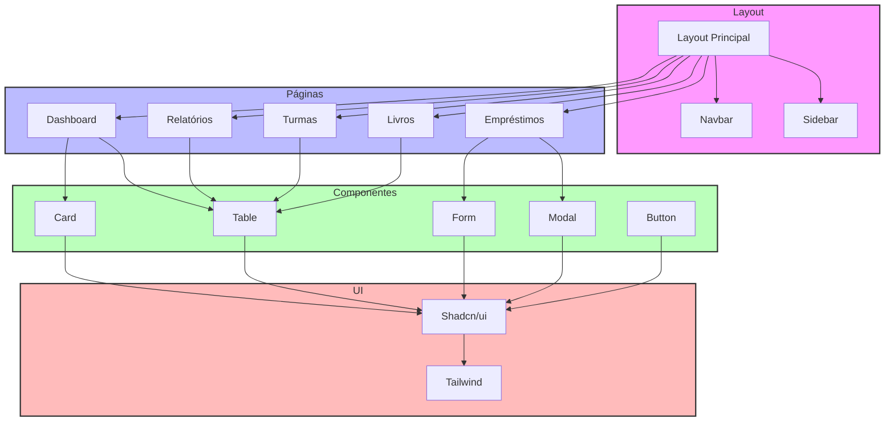

```mermaid
graph TB
    subgraph Layout
        L[Layout Principal]
        N[Navbar]
        S[Sidebar]
    end

    subgraph Páginas
        D[Dashboard]
        E[Empréstimos]
        R[Relatórios]
        T[Turmas]
        L2[Livros]
    end

    subgraph Componentes
        C1[Card]
        C2[Table]
        C3[Form]
        C4[Modal]
        C5[Button]
    end

    subgraph UI
        U1[Shadcn/ui]
        U2[Tailwind]
    end

    L --> N
    L --> S
    L --> D
    L --> E
    L --> R
    L --> T
    L --> L2

    D --> C1
    D --> C2
    E --> C3
    E --> C4
    R --> C2
    T --> C2
    L2 --> C2

    C1 --> U1
    C2 --> U1
    C3 --> U1
    C4 --> U1
    C5 --> U1

    U1 --> U2

    style Layout fill:#f9f,stroke:#333,stroke-width:2px
    style Páginas fill:#bbf,stroke:#333,stroke-width:2px
    style Componentes fill:#bfb,stroke:#333,stroke-width:2px
    style UI fill:#fbb,stroke:#333,stroke-width:2px
``` 