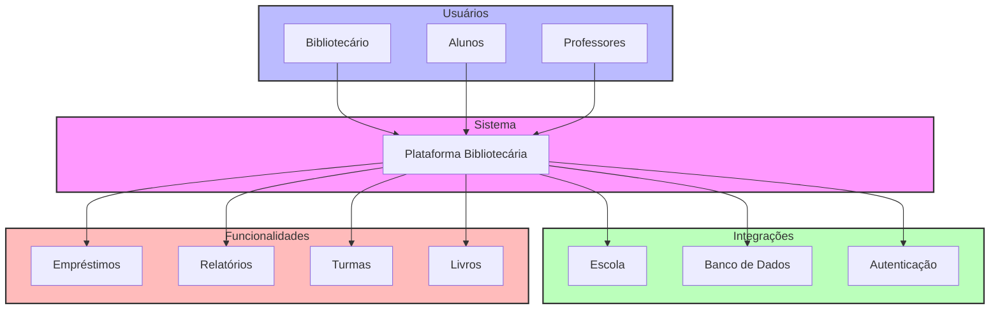

```mermaid
graph TB
    subgraph Sistema
        S[Plataforma Bibliotecária]
    end

    subgraph Usuários
        B[Bibliotecário]
        A[Alunos]
        P[Professores]
    end

    subgraph Integrações
        ES[Escola]
        BD[Banco de Dados]
        AUTH[Autenticação]
    end

    subgraph Funcionalidades
        E[Empréstimos]
        R[Relatórios]
        T[Turmas]
        L[Livros]
    end

    B --> S
    A --> S
    P --> S

    S --> ES
    S --> BD
    S --> AUTH

    S --> E
    S --> R
    S --> T
    S --> L

    style Sistema fill:#f9f,stroke:#333,stroke-width:2px
    style Usuários fill:#bbf,stroke:#333,stroke-width:2px
    style Integrações fill:#bfb,stroke:#333,stroke-width:2px
    style Funcionalidades fill:#fbb,stroke:#333,stroke-width:2px
``` 