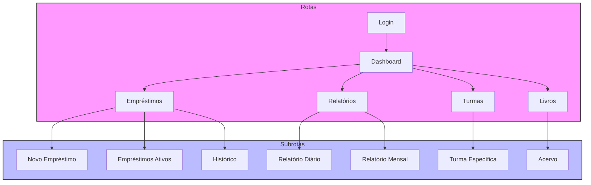

```mermaid
graph TB
    subgraph Rotas
        L[Login]
        D[Dashboard]
        E[Empréstimos]
        R[Relatórios]
        T[Turmas]
        L2[Livros]
    end

    subgraph Subrotas
        E1[Novo Empréstimo]
        E2[Empréstimos Ativos]
        E3[Histórico]
        R1[Relatório Diário]
        R2[Relatório Mensal]
        T1[Turma Específica]
        L1[Acervo]
    end

    L --> D
    D --> E
    D --> R
    D --> T
    D --> L2

    E --> E1
    E --> E2
    E --> E3
    R --> R1
    R --> R2
    T --> T1
    L2 --> L1

    style Rotas fill:#f9f,stroke:#333,stroke-width:2px
    style Subrotas fill:#bbf,stroke:#333,stroke-width:2px
``` 