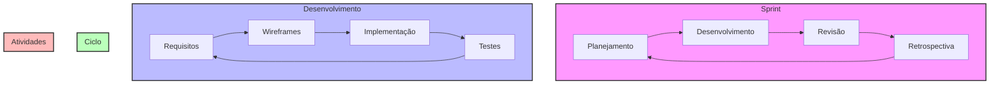

```mermaid
graph TB
    subgraph Sprint
        P[Planejamento]
        D[Desenvolvimento]
        R[Revisão]
        RT[Retrospectiva]
    end

    subgraph Desenvolvimento
        RQ[Requisitos]
        WF[Wireframes]
        IMP[Implementação]
        TEST[Testes]
    end

    subgraph Ciclo
        P --> D
        D --> R
        R --> RT
        RT --> P
    end

    subgraph Atividades
        RQ --> WF
        WF --> IMP
        IMP --> TEST
        TEST --> RQ
    end

    style Sprint fill:#f9f,stroke:#333,stroke-width:2px
    style Desenvolvimento fill:#bbf,stroke:#333,stroke-width:2px
    style Ciclo fill:#bfb,stroke:#333,stroke-width:2px
    style Atividades fill:#fbb,stroke:#333,stroke-width:2px
``` 